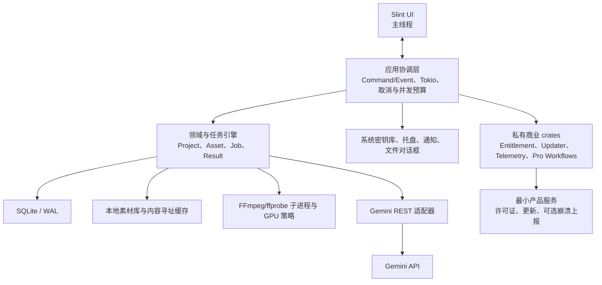

# Ovayra 本地优先桌面客户端设计

- 状态：已确认，等待书面规格复核
- 日期：2026-07-17
- 项目目录：`/Users/huachi/Code/03-video-toolkit/Ovayra`
- 品牌：Ovayra
- 商业落地页：[Ovayra.com](https://ovayra.com)

## 1. 摘要

Ovayra 是一个独立于 AVAWork 的本地优先视频 AI 工作台。它使用 Rust 和 Slint 构建原生桌面界面，在本机完成项目管理、任务队列、SQLite 持久化、FFmpeg 媒体处理、缓存、导出和崩溃恢复。视频、提示词和模型请求由客户端直接发送给 Gemini API，不经过 Ovayra 产品服务器。

首个公开版本同时支持：

- macOS 14+，Apple Silicon。
- Windows 10/11，x86-64。
- Linux x86-64，glibc，Wayland 或 X11。

产品采用“开放核心 + 闭源商业模块”模式。公开核心包含任务引擎、媒体管线、Gemini 适配器、SQLite、平台适配和社区版 UI；私有仓库包含许可证激活、自动更新、可选崩溃上报和高级工作流。

## 2. 背景与边界

AVAWork 当前是 Next.js/React + Cloud Run Web/API/Worker 架构，并已有一个仅用于验证的 Tauri Cloud Web 壳。Ovayra 不延续该运行时模型，也不把 Tauri scaffold 当作实现基础。

Ovayra 与 AVAWork 的关系是：

- 复用经过验证的产品认知、分析模式、提示词经验和用户工作流。
- 不复用 Hosted 任务 API、Cloud SQL、GCS、Cloud Tasks 或 Cloud Run Worker。
- 不要求兼容 AVAWork 数据库、任务 ID、历史记录、认证或 API 合约。
- 不提供 AVAWork 数据导入；两个产品从数据层完全独立。
- 不复制 Electron/Tauri WebView 壳或 Next.js 服务端结构。
- 任何提示词、文案或素材从 AVAWork 迁入前，都要单独确认来源、许可和当前有效性。

## 3. 产品目标

### 3.1 核心目标

1. 提供真正的 Rust 原生桌面 UI，不依赖浏览器或本地 Node/Next server。
2. 支持批量视频任务、FFmpeg 预处理、Gemini 分析、结果浏览、问答和结构化导出。
3. 所有任务状态与检查点在本机持久化，应用被强制终止后可恢复。
4. 首个公开版本即提供三平台硬件加速，并在不可用时安全降级到 CPU。
5. 用户自带 Gemini API Key；素材不经过 Ovayra 产品服务器。
6. 保持开放核心可独立使用，商业授权失效不得锁死开源基础能力。
7. 为未来音频、图像和更广泛的本地 AI 工作流保留扩展空间。

### 3.2 非目标

- 不做云端任务执行、云端素材托管或多设备数据同步。
- 不做团队协作、浏览器版或移动端。
- 不在首版提供第三方动态插件 ABI。
- 不在首版承诺全项目落盘加密。
- 不在首版承诺 FFmpeg 的完整跨平台沙箱。
- 不在首版支持 Intel Mac、Windows ARM64、Linux ARM64、musl/Alpine、无桌面会话环境或 Flatpak/Snap。
- 不承诺逐型号 GPU 认证、专业 HDR/Dolby Vision 母版保真或所有 codec/filter 组合。

## 4. 关键决策

| 决策 | 选择 | 理由 |
| --- | --- | --- |
| UI | Slint + Rust | 稳定 1.x API、声明式 UI、三平台支持和产品化工具链 |
| 进程模型 | 模块化单进程 + 托盘常驻 | 降低首版安装与升级复杂度，同时保留未来 daemon 拆分能力 |
| 异步运行时 | UI 主线程 + 后台 Tokio runtime | 保持 Slint 线程边界清晰，支持网络、取消和并发预算 |
| 数据库 | SQLite + WAL | 单用户、本地事务、迁移简单、崩溃恢复成熟 |
| 媒体执行 | 受控 FFmpeg/ffprobe CLI 子进程 | 便于版本固定、进程隔离、取消、日志收集和许可治理 |
| 素材模型 | 默认原位引用，可选托管副本 | 避免大视频强制复制，同时支持长期项目可复现 |
| 模型接入 | Gemini REST 适配器 | Rust 无需绑定特定 SDK；本地模型状态与 Google DTO 解耦 |
| 分析调用 | Files API + `generateContent`/流式 REST | 本地保存会话与结果，避免依赖产品云或远端线程状态 |
| 商业扩展 | 私有 crate 编译期组合 | 不泄漏闭源代码，也不在首版承担动态 ABI 风险 |
| 开源许可 | `MIT OR Apache-2.0` | 便于开放核心采用和商业组合；第三方依赖单独遵循其许可 |

## 5. 总体架构



### 5.1 线程与进程规则

- Slint 对象只在 UI 主线程访问。
- UI 向应用协调层发送不可变命令；后台通过有界事件通道返回状态快照。
- UI 不直接访问 SQLite、文件系统、Gemini 或 FFmpeg。
- Tokio runtime 负责 HTTP、计时、取消、队列调度和后台任务。
- SQLite 阻塞操作进入专用数据库执行边界，不能阻塞 UI 或网络 executor。
- FFmpeg/ffprobe 作为子进程运行；取消任务时终止整个子进程组。
- 关闭主窗口默认隐藏到系统托盘并继续执行；用户必须显式选择“退出 Ovayra”才结束进程。
- Linux 托盘不可用时显示明确提示，并退化为“窗口关闭即最小化/隐藏”或显式退出，不静默丢任务。

## 6. 仓库与 Cargo workspace

### 6.1 公开仓库

当前目录是 Ovayra 公开核心仓库的本地根目录。建议远端组织与仓库命名为 `ovayra/ovayra`，但创建远端仓库属于后续显式操作。

```text
Ovayra/
  Cargo.toml
  rust-toolchain.toml
  crates/
    domain/
    task-engine/
    storage-sqlite/
    media/
    provider-gemini/
    platform/
    ui-slint/
    app-community/
  assets/
  docs/
    architecture/
    compatibility/
    superpowers/specs/
  packaging/
  tests/
```

各 crate 职责：

- `domain`：项目、素材、任务、尝试、结果、错误和能力的纯领域类型。
- `task-engine`：状态机、调度、资源预算、重试、取消、检查点和恢复。
- `storage-sqlite`：schema migration、repository、事件日志与事务实现。
- `media`：ffprobe 解析、FFmpeg 执行计划、缓存键、GPU 探测和降级策略。
- `provider-gemini`：上传、远端文件状态、生成、流式解析、错误归一化和配额控制。
- `platform`：系统密钥库、托盘、通知、文件/目录对话框、路径和进程组差异。
- `ui-slint`：公共设计系统、工作区、队列、预览、结果和设置页面。
- `app-community`：公开发行版 composition root，只装配开放核心能力。

### 6.2 私有商业仓库

建议使用独立私有仓库 `ovayra/ovayra-pro`：

```text
ovayra-pro/
  crates/
    entitlement/
    updater/
    telemetry/
    pro-workflows/
    app-pro/
```

私有仓库只依赖公开仓库的已签名 tag 或已发布 crate，不复制公开源码。`app-pro` 是商业发行版 composition root，通过公开 capability traits 注册私有实现。社区版和 Pro 版共享领域、任务、媒体、Gemini、SQLite 和公共 UI 组件。

公开仓库中由 Ovayra 编写的源码使用 `MIT OR Apache-2.0`。Slint、FFmpeg 和其他依赖不因该声明被重新许可：官方商业二进制按当时有效的 Slint Royalty-free Desktop License 发行；社区自行构建时必须选择并遵守适用的 Slint 许可。公开发布和首个收费版本分别执行一次依赖许可复核。

## 7. 本地数据模型

SQLite 至少包含以下逻辑实体：

- `projects`：项目名称、工作区策略和展示设置。
- `assets`：源文件路径、所有权模式、大小、修改时间、快速指纹、完整哈希和可用状态。
- `jobs`：任务类型、当前状态、优先级、取消/暂停标志和活动 attempt。
- `job_attempts`：阶段、开始/结束时间、执行后端、重试原因和费用不确定标记。
- `job_events`：只追加的状态、进度、警告和错误事件。
- `artifacts`：代理视频、音轨、帧、临时输出、最终导出和内容哈希。
- `prompts`：版本化模板、用户覆盖、模型参数和内容指纹。
- `results`：结构化结果、原始模型输出、验证状态和时间戳索引。
- `remote_files`：Gemini file name、URI、MIME、远端状态、加密的上传 session、offset 和预计过期时间。
- `settings`：非敏感应用设置；密钥和许可证 lease 不进入该表。

规则：

- 每次任务阶段迁移、检查点和事件追加在同一 SQLite 事务中完成。
- 视频二进制不写入 SQLite。
- resumable upload URL 等临时 provider 凭据使用系统密钥库中的安装主密钥做字段级加密；SQLite 只保存带版本的密文。
- 结果先写临时文件，校验和 fsync 后原子改名，再提交 `SUCCEEDED`。
- schema migration 只前进；每次发行必须验证 N-1 数据库升级。
- 作业记录实际使用的 FFmpeg 构建、设备、decoder、filter 和 encoder，不能只记录“GPU 已开启”。

## 8. 素材所有权与缓存

### 8.1 默认原位引用

导入时保存：

- 规范化绝对路径。
- 文件大小和修改时间。
- 快速内容指纹。
- ffprobe 媒体摘要。

每次执行前重新验证。路径丢失或指纹变化时，任务进入需要用户处理的暂停状态，不能继续使用旧缓存。用户可通过文件对话框重新关联，重新关联后必须复核指纹并使不匹配派生物失效。

### 8.2 可选托管副本

长期项目可将素材复制到应用管理的素材库：

- 复制使用临时文件和原子改名。
- 使用 BLAKE3 完整哈希做内容寻址和去重。
- 项目删除不立即删除共享对象；垃圾回收只删除无引用且超过宽限期的对象。
- 清理操作必须先给出预计释放空间，并保留可恢复的失败记录。

### 8.3 派生缓存

缓存键包含源内容哈希、FFmpeg 构建 ID、完整参数、目标格式和相关能力版本。硬件与 CPU 产生的结果只在确认语义等价时共享缓存。

## 9. 任务生命周期

主状态机：

```text
DRAFT
  -> QUEUED
  -> PROBING
  -> PREPARING
  -> UPLOADING
  -> REMOTE_READY
  -> ANALYZING
  -> FINALIZING
  -> SUCCEEDED
```

侧向终态或等待态：

- `PAUSED`：用户暂停、素材缺失或需要确认费用不确定重试。
- `RETRY_WAIT`：可恢复错误的指数退避等待。
- `FAILED`：重试预算耗尽或明确不可恢复。
- `CANCELLED`：用户取消并完成本地清理。

恢复语义：

- `PROBING` 可安全重跑。
- FFmpeg 不承诺任意字节级续跑；从最后一个完整阶段边界重跑。
- 上传保存 resumable session 和 offset；session 无效时从本地派生文件重新开始。
- Gemini 文件已 `ACTIVE` 且未过期时复用，否则重新上传。
- 模型请求中途崩溃不能保证 exactly-once；再次调用前标记“可能产生额外费用”并要求策略允许或用户确认。
- `FINALIZING` 检查临时结果和校验和；无法证明完整时重做 finalization，不能把半成品标为成功。

应用启动时，所有非终态活动作业先进入内部 `RECOVERING` 流程，检查素材、artifact、上传 session、远端文件和上次 attempt，再决定恢复状态。`RECOVERING` 是恢复动作，不作为长期可见业务状态保存。

## 10. 资源调度

任务引擎分别维护以下并发预算：

- CPU 重任务。
- GPU decoder/encoder slot。
- 磁盘 I/O。
- 网络上传。
- Gemini 请求和 provider quota。

一个作业只有在获得当前阶段全部资源后才启动，避免拿着 GPU slot 等待网络或拿着数据库事务等待子进程。默认预算来自能力探测，用户可以降低但不能超过经过自检的安全上限。

## 11. Gemini 适配器

### 11.1 调用边界

- API Key 只从系统密钥库取出并在请求生命周期内驻留内存。
- Provider DTO 不能穿透到 `domain` 或 UI。
- 本地任务和聊天历史是规范状态；远端交互 ID 只作为可丢弃引用。
- 文件上传使用 Gemini resumable upload 协议；上传 URL 视作敏感临时凭据。
- 大文件和需要复用的媒体使用 Files API。为减少分支，首版本地视频统一使用 Files API；内联小文件优化延后。
- 批量分析使用 `generateContent` 或流式 REST；provider crate 负责将 API 变化隔离在适配器内部。
- 完成、取消或删除任务后尽力删除 Gemini 远端文件；Google 的保留规则仍是最终边界。

### 11.2 输入预处理

Gemini 当前接受 `video/webm`，因此 CPU 降级基线使用经过发布门禁验证的可再分发 WebM profile。硬件路径可以使用平台支持的 H.264/HEVC 等 profile，但必须在上传前验证 MIME、容器和实际 codec。

首个公开版本的发布门禁必须证明：

1. LGPL-only FFmpeg 构建能够在三平台生成 Gemini 可接受的 CPU fallback 文件。
2. 文件包含可用音轨和正确时长。
3. Gemini Files API 能成功处理并进入 `ACTIVE`。
4. 一个最小分析请求能返回结构化结果。

若该门禁失败，不能以“硬件设备通常可用”为理由发布。

### 11.3 错误归一化

Provider 错误至少归一化为：认证、配额、速率限制、网络、上传 session、远端处理、内容安全、模型不可用、响应无效和未知。UI 展示稳定的本地错误码，并保留经过脱敏的原始状态用于诊断。

## 12. FFmpeg 与硬件加速

### 12.1 官方支持矩阵

| 平台 | 正式支持 | 首选后端 | 尽力支持 | 明确排除 |
| --- | --- | --- | --- | --- |
| macOS | Apple Silicon，macOS 14+ | VideoToolbox | 新 macOS 首日兼容 | Intel Mac、macOS 13- |
| Windows | Windows 10/11 x86-64 | Media Foundation / D3D11VA，NVENC/NVDEC | Intel QSV、AMD AMF、虚拟机/RDP GPU | Windows ARM64、32-bit、Server Core |
| Linux | x86-64、glibc、Wayland/X11 | VAAPI，NVENC/NVDEC | 当前 Ubuntu LTS、Fedora 与支持期驱动 | ARM64、musl/Alpine、无桌面、首版 Flatpak/Snap |

### 12.2 能力探测

1. 枚举 FFmpeg build、后端、设备、codec/profile 和驱动。
2. 首次启动或检测到驱动变化时运行短样本自检。
3. 保存自检结果和设备指纹。
4. 任务按平台优先级选路，并记录实际路径。
5. 硬件阶段失败时，从阶段边界切换 CPU，并在当前会话将该后端标记为降级。

硬件加速范围是解码、标准化转码、缩放、抽帧、音轨提取和代理文件生成。Gemini 推理不属于本地 GPU 加速。

### 12.3 FFmpeg 发行规则

- 官方安装包捆绑固定版本的 FFmpeg/ffprobe CLI，不依赖用户系统版本。
- 构建不得启用 `--enable-gpl` 或 `--enable-nonfree`。
- 每个制品发布精确对应源码、补丁、configure 参数、许可证、Notice、校验和和 SBOM。
- 官网下载页、应用 About 和 EULA 按 FFmpeg 要求披露。
- 发布流水线自动检查实际 build configuration，不接受手工声明替代。
- codec 专利和各地区商业发行风险在首个收费版本前完成法律复核；开源许可合规不等同于专利许可结论。

## 13. 平台密钥与本地安全

| 平台 | 首选密钥后端 |
| --- | --- |
| macOS | Keychain Services |
| Windows | Credential Manager / DPAPI |
| Linux | Secret Service over D-Bus |

规则：

- Gemini Key、许可证 lease 和安装主密钥不得写入 SQLite、日志或普通配置文件。
- 系统密钥库不可用时，只允许会话内密钥；不能静默回退明文存储。此时不持久化 resumable upload URL，应用退出后从本地文件重新开始上传。
- SQLite、结果和缓存首版依赖用户目录权限，不宣称静态加密。
- FFmpeg 处理不可信媒体时使用独立工作目录、超时、资源限制和子进程组；首版不宣称完整沙箱。
- 导出路径经过规范化和用户确认，临时文件不能越出目标目录。
- 本地日志轮转、默认脱敏；支持包必须让用户预览后主动导出。

## 14. 网络与隐私边界

### 14.1 Gemini API

用户明确启动分析后，客户端可向 Gemini 发送：

- Gemini API Key。
- 选定媒体或本地派生文件。
- Prompt、模型参数和对话内容。

### 14.2 Ovayra 最小产品服务

商业版可访问：

- `license.ovayra.com`：许可证激活和签名 lease。
- `updates.ovayra.com`：签名 manifest 与安装包。
- `crash.ovayra.com`：用户明确同意后的脱敏崩溃上报。

产品服务可以接收许可证凭据、散列安装 ID、应用版本、更新通道、OS/架构和脱敏崩溃栈。它们永远不得接收 Gemini Key、媒体、文件名/路径、Prompt、模型结果或项目数据库。

崩溃上报在用户同意前保持关闭。匿名崩溃栈必须剥离本地路径、请求体、密钥和内容。手工支持包是独立流程，不能复用自动上报许可。

## 15. 商业授权与更新

### 15.1 授权

- 服务端返回 Ed25519 签名 lease；客户端只内置验证公钥。
- lease 包含 entitlement、到期、离线宽限和安装绑定声明。
- 离线宽限由签名策略声明，客户端不得自行延长。
- lease 失效只关闭商业 capability；社区版核心项目、已有本地数据和基础导出仍可访问。
- 许可证服务不得成为应用启动的单点故障。

### 15.2 自动更新

- manifest 和安装包分别签名并带 SHA-256。
- Stable/Beta 通道由用户选择。
- 拒绝未签名、哈希不符、平台/架构不符或违反版本回退策略的包。
- 数据库迁移在替换应用前验证兼容性；失败时保留原版本和数据库备份。
- 更新器不能覆盖用户项目、缓存清理策略或密钥库条目。
- 首版官方制品为：macOS notarized `.app`/`.dmg`、Windows 签名 `.msi`、Linux AppImage 和 `.deb`。应用内原位更新覆盖 macOS、Windows 和 AppImage；`.deb` 只检查并下载更新，不尝试静默获得 root 权限替换系统包。

## 16. UI 信息架构

首版 Slint 工作台包含：

1. 项目与素材导航。
2. 任务创建和分析配置。
3. 可排序、可暂停、可取消的任务队列。
4. 视频预览与时间戳跳转。
5. 当前阶段、实际硬件后端、上传进度、Gemini 状态和费用风险提示。
6. 分析结果、结构化视图、原始输出和本地问答。
7. 导出中心。
8. 模型与 Prompt 管理。
9. 存储、密钥、隐私、更新和诊断设置。

UI 必须展示事实而不是意图。例如，“GPU”标签只在实际阶段使用硬件后端后显示；降级后展示 CPU 和降级原因。任务恢复前若可能重复计费，不能自动隐藏该风险。

## 17. 测试策略

### 17.1 自动化层

- 领域与属性测试：状态迁移、重试预算、取消、资源调度和缓存键。
- SQLite 测试：迁移、事务、崩溃中断、N-1 升级和并发读取。
- FFmpeg 契约测试：参数生成、进度解析、取消、进程组、乱码和异常退出。
- Gemini mock 测试：续传、offset、远端状态、限流、无效响应和删除。
- 恢复 E2E：在每个活动阶段强制终止应用，重启后验证重跑、续传或费用确认。
- UI 测试：状态投影、核心键盘路径、错误和关键页面截图回归。
- 供应链：`cargo audit`、`cargo deny`、secret scan、SBOM、许可证和制品签名。

### 17.2 真实设备门禁

- Apple Silicon：VideoToolbox、休眠/唤醒、托盘、Keychain、签名和 notarization。
- Windows x86-64：MF/D3D11VA、NVIDIA、Credential Manager、安装/卸载/升级和 Defender。
- Linux x86-64：Wayland/X11、VAAPI、NVIDIA、Secret Service、AppImage/deb 和无托盘降级。
- Gemini 实网 smoke：专用低配额密钥、小型公开样本，只在受控 release gate 运行。
- 更新演练：N-1 到 N、断网、损坏包、签名错误、版本回退和 schema 不兼容。

## 18. 分阶段交付

### 阶段 0：高风险技术 Spike

必须在大规模 UI 开发前验证：

1. Slint 中可用的视频预览表面和主线程更新模型。
2. 三平台 FFmpeg 硬件探测、自检和 CPU fallback。
3. Rust Gemini resumable upload、远端处理轮询和最小分析。
4. 三平台托盘、系统密钥库和进程组取消。
5. 安装签名、更新 manifest 和 LGPL-only FFmpeg 发行链。

每个 Spike 产出可运行最小程序、测量结果和 ADR。任何一项失败都先调整架构，不在其上堆叠产品功能。

### 阶段 1：开放核心

实现领域模型、SQLite、状态机、素材策略、FFmpeg CLI 适配器、Gemini REST 适配器和无 UI 集成测试。

### 阶段 2：桌面工作台

实现 Slint 项目界面、任务队列、预览、Prompt、结果、问答、导出、设置和托盘行为。

### 阶段 3：商业产品化

实现私有 entitlement、updater、telemetry 和 Pro workflows，完成三平台制品、签名、SBOM 和许可发布门禁。

### 阶段 4：公开 Beta

完成真实设备矩阵、恢复压力测试、升级/回滚演练、隐私审计、支持文档和 Ovayra.com 商业落地页对接。

## 19. 首个公开版本验收条件

1. 三个正式平台都能安装、启动、退出、托盘运行和卸载。
2. 用户能导入原位素材或创建托管副本，并在文件移动后重新关联。
3. 队列能暂停、继续、取消并在应用强杀后恢复。
4. 每个平台至少一个正式硬件后端通过真实设备闭环；不可用时 CPU fallback 能完成同类任务。
5. Files API 上传可续传；远端文件状态和过期行为不会破坏本地结果。
6. Gemini 请求中断后的费用不确定性会被持久化并展示。
7. SQLite、日志、崩溃包和产品服务请求不包含 Gemini Key 或媒体内容。
8. 所有安装包可验证签名，并附 SBOM、Notice、FFmpeg 对应源码和校验和。
9. 社区版在没有 Ovayra 许可证服务的情况下仍能完成基础本地工作流。
10. 支持矩阵、明确排除设备和降级规则在应用与 Ovayra.com 文档中一致。

## 20. 主要风险与控制

| 风险 | 控制 |
| --- | --- |
| Slint 视频预览集成不足 | 阶段 0 Spike；保持预览接口与 UI 解耦，失败时可替换后端 |
| 三平台 GPU 行为碎片化 | 能力探测 + 自检 + 实际后端记录 + CPU fallback |
| FFmpeg 许可或 codec 专利风险 | LGPL-only 可复现构建、法律发布门禁、官网披露和 SBOM |
| Gemini API 变化 | 隔离 provider DTO、契约测试、版本化 adapter |
| 模型重试重复计费 | attempt 与费用不确定标记持久化，重试前策略确认 |
| 本地数据库损坏 | WAL、事务、备份、迁移测试和恢复工具 |
| 私有代码污染公开仓库 | 双仓库、已签名 tag 依赖、独立 composition root |
| Linux 桌面差异 | 明确发行版和显示栈边界、真实设备测试、托盘降级 |
| 更新供应链攻击 | 离线签名密钥、双重签名/哈希验证、回退保护 |
| 名称与域名混淆 | 正式品牌固定为 Ovayra；Ovayra.com 已购入并作为唯一商业落地页 |

## 21. 来源与约束依据

- [Slint 官方仓库](https://github.com/slint-ui/slint)：稳定 1.x、桌面平台与许可说明。
- [Slint Desktop 支持](https://docs.slint.dev/latest/docs/slint/guide/platforms/desktop/)：Windows、macOS、Linux、Wayland/X11、glibc 和 D-Bus 边界。
- [Slint Royalty-free License](https://slint.dev/agreements/slint-royalty-free-license.pdf)：专有桌面应用发行许可；商业发布前仍需按当时条款复核。
- [Gemini Video Understanding](https://ai.google.dev/gemini-api/docs/video-understanding)：Files API、视频限制与支持 MIME，包括 `video/webm`。
- [Gemini Files API](https://ai.google.dev/gemini-api/docs/files)：resumable upload、文件状态、删除和保留规则。
- [Gemini API Reference](https://ai.google.dev/api)：REST 生成与流式接口。
- [FFmpeg CLI 文档](https://ffmpeg.org/ffmpeg.html)：VideoToolbox、D3D11VA、VAAPI、QSV 等硬件路径。
- [FFmpeg License and Legal Considerations](https://ffmpeg.org/legal.html)：LGPL/GPL、`--enable-gpl`、`--enable-nonfree` 和发行清单。

## 22. 设计结论

Ovayra 的可行性结论是“可行，但应作为独立产品从领域核心和高风险 Spike 开始”，而不是把 AVAWork 的 Web/Cloud 架构机械翻译成 Rust。模块化单进程足以支撑首版托盘常驻和崩溃恢复；通过稳定接口保留未来拆分本地 daemon 的可能。三平台硬件加速、Slint 视频预览、Gemini 续传和合规 FFmpeg 发行是最先验证的四个技术门槛。

在本设计获得书面复核后，下一步是编写逐任务实施计划，而不是直接进入全量编码。
